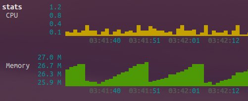

# docker-container-stats

Terminal dashboard with container stats.



## Running

```
docker run -it --name stats \
    -v /var/run/docker.sock:/var/run/docker.sock \
    kennethkl/container-stats
```
